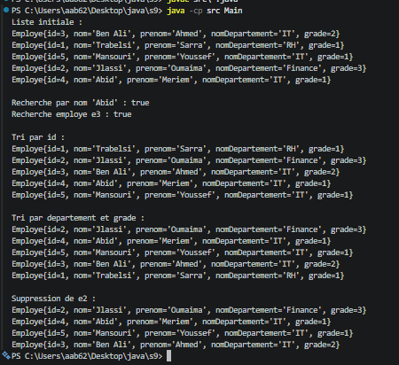

# Java Prosit 9

**Ahmed Amine Boussetta — 3IA1**

---

### Setup
```bash
winget install Microsoft.OpenJDK.17
java -version
javac -version
```

### Compile
```bash
javac src\*.java
```

---

### Run
```bash
java -cp src Main
```

---

### Output
